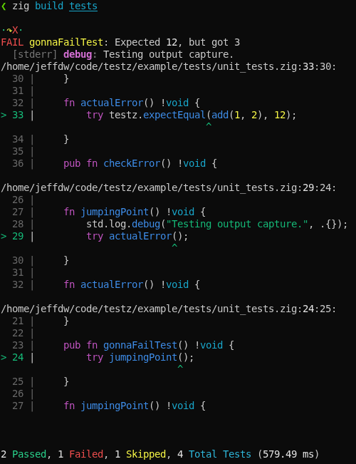
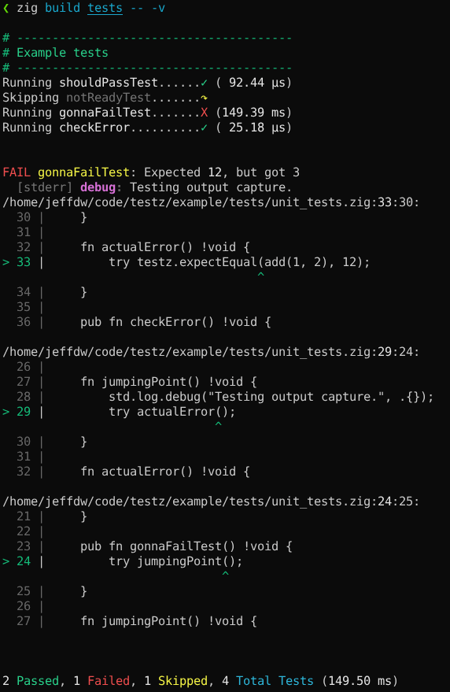

# Overview

Testz is a testing library for zig that provides some extra features compared to the built in unit testing.

- Color output with both a verbose mode and non-verbose mode
  - A non-verbose mode, where each test shows as a symbol for passed, skipped, or failed:

    

  - In verbose mode, you can see the name of each test run and how long it took to run.

    

  - In both cases a test run summary lets you know how many tests ran and the overall time.

- Easy filtering by group tag or test name itself
  - Making it easier to set a breakpoint and debug a single test.

- Provides a test runner utility function with argument parsing for a default use case.

- Has a test discovery helper that searches for tests by finding public functions in a passed in module, allowing tests to be skipped by prepending `skip_` to the start of the function name.

- Stack traces of relevant code only
  - Skips stack frames from `testz` itself as well as `main` where the test runner is called.
  - Stack traces provide context lines around the stack frame.
  - Uses tree-sitter to add highlighting to zig code

- Per-test stdout/stderr capture, shown alongside failure output so diagnostic prints don't get lost in the overall run.
    - Note: doesn't work on Windows properly.

Testz runners are just another executable you setup in your `build.zig`, where the library provides a number of helpers to make it as easy as possible to create tests.  Debugging is simple since you can run your debugger just like with any normal flat executable and use the built in filtering to narrow down what test or set of tests gets run.

# Example

Check the example program under `example/` with a main program and a separate test program.

## Test module

A module of tests looks like:

```zig
const std = @import("std");
const testz = @import("testz");

pub fn allowNonTestzErrors() !void {
    const mem = try std.heap.page_allocator.alloc(u8, 10);
    defer std.heap.page_allocator.free(mem);
    try testz.expectEqual(true, true);
}

pub fn alwaysFail() !void {
    try testz.fail();
}

pub fn successTest() !void {
    try testz.expectEqual(12, 12);
    try testz.expectEqualStr("hello", "hello");
    try testz.expectNotEqual(10, 20);
    try testz.expectNotEqualStr("hello", "world");
    try testz.expectTrue(true);
    try testz.expectFalse(false);
}

pub fn skip_notReadyYet() !void {
    // prepend skip_ to any function name to have it skipped at runtime
}
```

The test functions are simply any public function in a module you pass into `discoverTests`.  The `testz` library has a number of `expectXYZ` functions you can use to make assertions in your code.  If one fails, `testz` will capture the name of the failed test, error message, and stack trace (with contextual lines).

## Test function signatures

Testz discovers two function signatures automatically:

**Basic** — no parameters, the simplest form:

```zig
pub fn myTest() !void {
    try testz.expectEqual(1 + 1, 2);
}
```

**Full** — receives `std.Io` and `std.mem.Allocator`:

```zig
pub fn myAllocatingTest(io: std.Io, alloc: std.mem.Allocator) !void {
    const buf = try alloc.alloc(u8, 64);
    defer alloc.free(buf);
    try testz.expectEqual(buf.len, 64);
}
```

Full tests are useful when the code under test needs an allocator or I/O.  Testz passes a `DebugAllocator`-backed allocator, so memory leak detection is automatic: if the test body passes but leaks memory, the test is still recorded as a failure.

Both forms are discovered side-by-side in the same module — there is no configuration needed to mix them.

## Expect / assertion functions

| Function | Description |
|---|---|
| `expectEqual(actual, expected)` | Passes if `actual == expected`. Works with optionals. |
| `expectEqualT(T, actual, expected)` | Typed variant of `expectEqual` — both args coerced to `T`. |
| `expectEqualStr(actual, expected)` | Passes if the two strings are equal; reports first differing index and lengths on failure. |
| `expectNotEqual(actual, expected)` | Passes if `actual != expected`. |
| `expectNotEqualStr(actual, expected)` | Passes if the two strings differ. |
| `expectTrue(actual)` | Passes if `actual == true`. |
| `expectFalse(actual)` | Passes if `actual == false`. |
| `expectError(actual, expected)` | Passes if the error union `actual` holds the error `expected`. |
| `fail()` | Unconditionally fails the test. |
| `failWith(err)` | Fails the test and includes `err` in the failure message — useful for custom enum values or runtime context. |

### Test Runner

Here is an example test runner program using the built-in `testzRunner` method, as you could use in your project, which handles standard argument parsing.  It also shows test discovery by passing in modules as groups to the `discoverTests` method.

```zig
const std = @import("std");
const testz = @import("testz");

const DiscoveredTests = testz.discoverTests(.{
    testz.Group{ .name = "Expect Tests", .tag = "expect", .mod = @import("./expect_tests.zig") },
    testz.Group{ .name = "Misc Tests",   .tag = "misc",   .mod = @import("./misc_tests.zig") },
}, .{});

pub fn main(init: std.process.Init) !void {
    try testz.testzRunner(DiscoveredTests, init.minimal.args);
}
```

The function `testz.discoverTests` takes a tuple of modules (or `Group`/`GroupList` structs) and a `DiscoverOpts` struct, and returns a comptime slice of `TestFuncInfo`.

## Test discovery in depth

### Plain modules

The simplest usage is to pass a bare `@import` directly.  Tests land in a group called `"default"`:

```zig
const Tests = testz.discoverTests(.{
    @import("my_tests.zig"),
}, .{});
```

### `Group` — one module, one tag

Wraps a single module with a display name and filter tag:

```zig
testz.Group{ .name = "Auth Tests", .tag = "auth", .mod = @import("auth_tests.zig") }
```

### `GroupList` — multiple modules under one tag

Collects several modules under a single group name and tag, handy when you split a large test suite across files:

```zig
testz.GroupList{
    .name = "Auth Tests",
    .tag  = "auth",
    .mods = &.{
        @import("login_tests.zig"),
        @import("token_tests.zig"),
        @import("session_tests.zig"),
    },
}
```

### `DiscoverOpts`

The second argument to `discoverTests` is a `DiscoverOpts` struct with these fields:

| Field | Default | Description |
|---|---|---|
| `testsEndWithTest` | `false` | When `true`, only functions whose names end with `"Test"` are collected. Useful when test files also contain helper functions you don't want auto-discovered. |
| `debugDiscovery` | `false` | Emits `@compileLog` lines for every function examined during discovery, so you can see exactly why a function was or wasn't picked up. |

## CLI flags

When you use `testzRunner`, your test binary accepts the following flags:

| Flag | Short | Default | Description |
|---|---|---|---|
| `--verbose` | `-v` | off | Show each test name, pass/fail symbol, and elapsed time. |
| `--stack_trace` | `-s` | **on** | Print stack traces with context lines on failure. Pass `--no-stack_trace` to disable. |
| `--groups` | `-g` | — | List all available group names and their filter tags, then exit. Use this to discover what tags you can filter on. |
| `--capture` | `-c` | off | Capture stdout and stderr written during each test at the OS level. Captured output from failing tests is shown in the failure section; captured output from passing tests is shown inline in verbose mode. |
| `--color` | — | **on** | Force ANSI color output even when not writing to a TTY. |
| `--help` | `-h` | — | Print usage text and exit. |

Positional arguments are treated as filters.  Pass one or more group tags or exact test function names to run only the matching tests:

```sh
# run only the "auth" group
./tests auth

# run only a specific test by name
./tests test_login_with_bad_password

# combine multiple filters
./tests auth billing
```

This makes it easy to set a breakpoint in your debugger and re-run a single test without recompiling.

## Advanced: using `runTests` directly

`testzRunner` is a convenience wrapper that parses `argv` for you.  For more control — custom argument handling, embedding testz in a larger harness, or programmatic test selection — call `runTests` directly:

```zig
const passed = try testz.runTests(myTests, .{
    .verbose              = true,
    .captureOutput        = true,
    .printStackTraceOnFail = false,
    .allowFilters         = &.{ "auth", "billing" },
    .alloc                = my_allocator,
});
```

`RunTestOpts` fields:

| Field | Default | Description |
|---|---|---|
| `verbose` | `false` | Verbose per-test output. |
| `captureOutput` | `false` | Capture stdout/stderr per test. |
| `printStackTraceOnFail` | `true` | Include stack trace in failure output. |
| `allowFilters` | `null` | Slice of group tags or test names to run; `null` means run all. |
| `printColor` | `null` | `null` = auto-detect TTY, `true`/`false` = force on/off. |
| `alloc` | `page_allocator` | Allocator used for test bookkeeping. |
| `writer` | stdout | A `Printer` to direct output to (e.g. an in-memory buffer for testing `testz` itself). |
| `testContext` | `null` | A pre-existing `TestContext` to push onto the context stack. |

### A `build.zig` Setup

Run `zig fetch --save https://github.com/srjilarious/testz` to add `testz` as a dependency in your `build.zig.zon` file.

Next, in your `build.zig`, you would create a new exe for your tests and add:

```zig
    const testzMod = b.dependency("testz", .{});
    [...]
    testsExe.root_module.addImport("testz", testzMod.module("testz"));
```
See the project under `example/` for how this looks in a simple dummy project.

# Contributing

Feel free to open an issue or open a PR if there is a feature you'd like to see!
