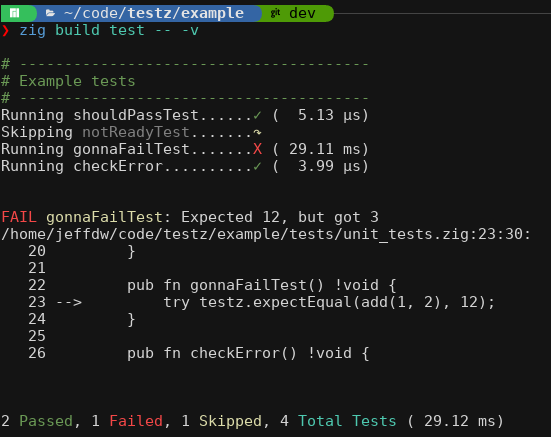

# Overview

Testz is a testing library for zig that provides some extra features compared to the built in unit testing.

- Color output with both a verbose mode and non-verbose mode
  - In verbose mode, you can see the name of each test run
  - In both cases a test run summary lets you know how many tests ran.
- Easy filtering by group tag or test name itself
  - Making it easier to set a breakpoint and debug a single test.
- Stack traces of relevant code only
  - Skips stack frames from `testz` itself as well as `main` where the test runner itself is called.
- Provides a test runner with argument parsing for a default use case.
- Has a test discovery helper that searches for tests by finding functions ending in `Test`, allowing tests to be skipped by prepending `skip_` to the start of the function name.

Testz runners are just another executable you setup in your `build.zig`, which provides a number of helpers to make it as easy as possible to create tests.  This makes debugging really easy since you can attach gdb, etc and use the built in filtering to narrow down what test or set of tests gets run.

# Example

Here's what a project running a couple of tests without errors in non-verbose mode looks like:


Here's an example from `testz` itself showing verbose output with a number of tests failing (on purpose in this case):



## Code example

### Test module

Here's what a module of tests looks like:

```
const std = @import("std");
const testz = @import("testz");

pub fn allowNonTestzErrorsTest() !void {
    const mem = try std.heap.page_allocator.alloc(u8, 10);
    defer std.heap.page_allocator.free(mem);
    try testz.expectEqual(true, true);
}

pub fn alwaysFailTest() !void {
    try testz.fail();
}

pub fn successTest() !void {
    try testz.expectEqual(12, 12);
    try testz.expectEqualStr("hello", "hello");
    try testz.expectNotEqual(10, 20);
    try testz.expectNotEqualStr("hello", "world");
    try testz.expectTrue(true);
    try testz.expectFalse(false);
}

pub fn skip_Test() !void {
    // nothing to see here.
}
```

The test functions all end in `Test` and are public.  The `testz` library has a number of `expectXYZ` functions you can use to make assertions in your code.  If one fails, `testz` will capture the name of the failed test, error message, and stack trace (with contextual lines).

### Test Runner 

Here is an example test runner program, showing test discovery and using the built in test runner with standard argument parsing.

```tests/main.zig
const std = @import("std");
const testz = @import("testz");

const DiscoveredTests = testz.discoverTests(.{ 
    testz.Group{ .name = "Expect Tests", .tag = "expect", .mod = @import("./expect_tests.zig") }, 
    testz.Group{ .name = "Misc Tests", .tag = "misc", .mod = @import("./misc_tests.zig") } 
});

pub fn main() !void {
    try testz.testzRunner(DiscoveredTests);
}
```

The function `testsz.discoverTests`, takes a tuple of either direct module `@import`s, or `testz.Group` structs, which contain a group name and tag for filtering as well as the module to scan for test functions.

### A `build.zig` Setup

In your `build.zig`, you would have something like (assuming the library is pulled in from your `build.zig.zon`):

```
    const testzMod = b.dependency("testz", .{});
    [...]
    exe.root_module.addImport("testz", testzMod.module("testz"));
```

Where the middle portion is the standard exe setup, so the full thing would look like:
```
  const testzMod = b.dependency("testz", .{});
  const exe = b.addExecutable(.{
        .name = "unit_tests",
        // In this case the main source file is merely a path, however, in more
        // complicated build scripts, this could be a generated file.
        .root_source_file = .{ .path = "tests/main.zig" },
        .target = target,
        .optimize = optimize,
    });
    exe.root_module.addImport("testz", testzMod.module("testz"));

    // This declares intent for the executable to be installed into the
    // standard location when the user invokes the "install" step (the default
    // step when running `zig build`).
    b.installArtifact(exe);

    // This *creates* a Run step in the build graph, to be executed when another
    // step is evaluated that depends on it. The next line below will establish
    // such a dependency.
    const run_cmd = b.addRunArtifact(exe);

    // By making the run step depend on the install step, it will be run from the
    // installation directory rather than directly from within the cache directory.
    // This is not necessary, however, if the application depends on other installed
    // files, this ensures they will be present and in the expected location.
    run_cmd.step.dependOn(b.getInstallStep());

    // This allows the user to pass arguments to the application in the build
    // command itself, like this: `zig build run -- arg1 arg2 etc`
    if (b.args) |args| {
        run_cmd.addArgs(args);
    }

    // This creates a build step. It will be visible in the `zig build --help` menu,
    // and can be selected like this: `zig build run`
    // This will evaluate the `run` step rather than the default, which is "install".
    const run_step = b.step("run", "Run the app");
    run_step.dependOn(&run_cmd.step);
```

# Planned Features

The library is already usable, but does have some features that are not yet implemented.  As it develops I make well change the formatting output as well, although a goal is to make writing your own test runner with custom formatting a mostly trivial exercise.

### Roadmap / Ideas
[ ] Change to using `io.Writer` rather than `std.debug.print` directly.
[ ] Add no-color option, check for tty before outputting colors.
[ ] Capture number of assertions in each test
[ ] Capture time of each test, group of tests and overall.

