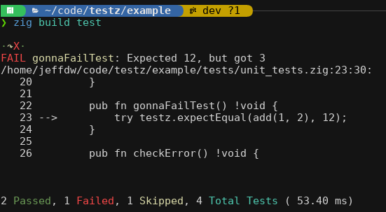

# Overview

Testz is a testing library for zig that provides some extra features compared to the built in unit testing.

- Color output with both a verbose mode and non-verbose mode
  - In verbose mode, you can see the name of each test run and how long it took to run.
  - In both cases a test run summary lets you know how many tests ran and the overall time.
- Easy filtering by group tag or test name itself
  - Making it easier to set a breakpoint and debug a single test.
- Stack traces of relevant code only
  - Skips stack frames from `testz` itself as well as `main` where the test runner is called.
- Provides a test runner utility function with argument parsing for a default use case.
- Has a test discovery helper that searches for tests by finding public functions in a passed in module, allowing tests to be skipped by prepending `skip_` to the start of the function name.

Testz runners are just another executable you setup in your `build.zig`, with the library providing a number of helpers to make it as easy as possible to create tests.  Debugging is simple since you can run your debugger just like with any normal flat executable and use the built in filtering to narrow down what test or set of tests gets run.

# Example

Here's what the example project running a couple of tests in non-verbose mode looks like:



Here's the verbose mode of output from the example project:


## Code example

### Test module

Here's what a module of tests looks like:

```zig
const std = @import("std");
const testz = @import("testz");

pub fn allowNonTestzErrorsTest() !void {
    const mem = try std.heap.page_allocator.alloc(u8, 10);
    defer std.heap.page_allocator.free(mem);
    try testz.expectEqual(true, true);
}

pub fn alwaysFailTest() !void {
    try testz.fail();
}

pub fn successTest() !void {
    try testz.expectEqual(12, 12);
    try testz.expectEqualStr("hello", "hello");
    try testz.expectNotEqual(10, 20);
    try testz.expectNotEqualStr("hello", "world");
    try testz.expectTrue(true);
    try testz.expectFalse(false);
}

pub fn skip_Test() !void {
    // nothing to see here.
}
```

The test functions are simply any public function in a module you pass into `discoverTests`.  The `testz` library has a number of `expectXYZ` functions you can use to make assertions in your code.  If one fails, `testz` will capture the name of the failed test, error message, and stack trace (with contextual lines).

### Test Runner 

Here is an example test runner program that you would create in your project.  It shows test discovery and using the built in test runner with standard argument parsing.

```tests/main.zig
const std = @import("std");
const testz = @import("testz");

const DiscoveredTests = testz.discoverTests(.{ 
    testz.Group{ .name = "Expect Tests", .tag = "expect", .mod = @import("./expect_tests.zig") }, 
    testz.Group{ .name = "Misc Tests", .tag = "misc", .mod = @import("./misc_tests.zig") } 
});

pub fn main() !void {
    try testz.testzRunner(DiscoveredTests);
}
```

The function `testsz.discoverTests`, takes a tuple of either direct module `@import`s, or `testz.Group` structs, which contain a group name and tag for filtering as well as the module to scan for test functions.

### A `build.zig` Setup

Run `zig fetch --save https://github.com/srjilarious/testz` to add `testz` as a dependency in your `build.zig.zon` file.

Next, in your `build.zig`, you would create a new exe for your tests and add:

```zig
    const testzMod = b.dependency("testz", .{});
    [...]
    testsExe.root_module.addImport("testz", testzMod.module("testz"));
```
See the project under `example/` for how this looks in a simple dummy project.

# Planned Features

The library has all of the initial features I set out to implement.  Feel free to open an issue or open a PR if there is a feature you'd like to see!

### Roadmap / Ideas
- [ ] Capture number of assertions in each test

